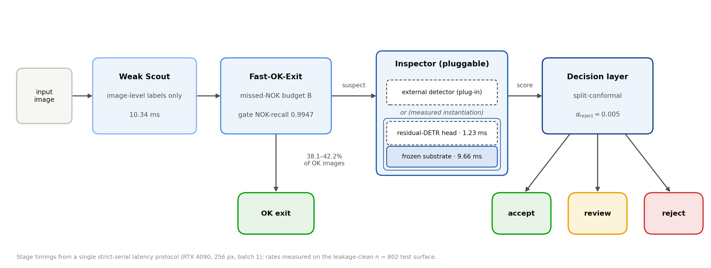

# Selective Inspection

Companion code repository for the paper:

> **Learning When Not to Inspect: Risk-Calibrated Weak Supervision for Efficient Industrial Visual Inspection**
>
> 📄 [Read the paper (PDF)](docs/paper.pdf)

## 1. What this is

Most inline production images are normal. This repository implements the paper's
risk-calibrated selective-inspection cascade — the three pieces a line needs to
*spend compute only where suspicion remains*:

1. **A weak scout** (`scout_image_bce`): a DETR-lite image scorer over an
   ImageNet-pretrained ResNet-18, trained with binary cross-entropy from
   **image-level OK/NOK labels only** — no boxes, no masks. Image labels are the
   labels a production line accumulates first.
2. **A risk-calibrated Fast-OK-Exit gate**: the exit threshold `tau_exit` is the
   largest threshold that keeps wrongly-exited validation NOK images within an
   operator-chosen missed-NOK budget `B` (e.g. 0% or ≤1%), calibrated on
   validation only and applied frozen. Images scoring below `tau_exit` are
   admitted OK on the spot and bypass all downstream compute.
3. **A split-conformal accept/review/reject decision layer**: thresholds are
   order statistics of the validation OK scores; the reject rate carries a
   finite-sample guarantee `P(OK rejected) ≤ alpha_reject` under
   exchangeability, certifiable iff `alpha ≥ 1/(n_cal+1)`.

The **inspector** (the expensive model that examines routed images) is
deliberately external: any callable that maps an image to an anomaly score
plugs in unchanged (see `pipeline.py` and section 8 below). The cascade claims
none of the inspector's accuracy as its own.



*Figure: the cascade (Figure 1 of the paper) — weak scout → Fast-OK-Exit under
a missed-NOK budget → pluggable inspector → subordinated conformal
accept/review/reject layer.*

All deployment knobs — the exit budget `B`, the decision-layer strictness
`alpha`, the inspector choice — are **post-hoc**: they reconfigure a deployed
line without retraining (calibration is one validation pass).

## 2. Install

```bash
git clone <this-repo>
cd selective-inspection

python -m venv .venv
source .venv/bin/activate        # Windows: .venv\Scripts\activate
pip install -r requirements.txt
```

Requirements: Python ≥ 3.10, `torch`, `timm`, `numpy`, `pyyaml`, `pillow`,
`onnx`, `onnxruntime` (see `requirements.txt`).

**CUDA note.** `pip install torch` pulls a CUDA-enabled build on Linux; check
`python -c "import torch; print(torch.cuda.is_available())"`. If you need a
specific CUDA toolkit match, follow <https://pytorch.org/get-started/locally/>.

- **Training**: GPU strongly recommended (the paper recipe trains in minutes on
  a single RTX 4090). CPU training works for smoke tests only.
- **Inference**: CPU works (PyTorch or ONNX Runtime); GPU is faster.
- Device policy: `--device cuda` **raises** if CUDA is unavailable (no silent
  CPU fallback); `--device auto` (default) picks CUDA when available and logs
  the choice.

## 3. Data: the manifest contract

All tools consume **JSONL manifests** — one JSON object per line:

```json
{"image_path": "images/train/part_0001.png", "label": "ok"}
{"image_path": "images/train/part_0002.png", "label": "nok", "image_id": "part_0002"}
```

| Field | Required | Meaning |
|---|---|---|
| `image_path` | yes | Absolute path, or relative to the current working directory, or relative to the manifest file's directory (resolved in that order). |
| `label` | yes | `"ok"` (normal) or `"nok"` (defective), case-insensitive. Anything else raises. |
| `image_id` | no | Stable identifier (defaults to the file stem). Used to join predictions with labels. |

Images are **not** included in this repository and are never committed
(`.gitignore` excludes `data/`).

### Building manifests for MVTec-AD

The paper's benchmark dataset is [MVTec AD](https://www.mvtec.com/company/research/datasets/mvtec-ad)
(download from the official page; free for research). Its folder layout is
`<category>/train/good/*.png`, `<category>/test/good/*.png`,
`<category>/test/<defect_type>/*.png`. A minimal folder→manifest builder:

```python
import json
from pathlib import Path

root = Path("mvtec_anomaly_detection")           # extracted dataset root
rows = []
for img in sorted(root.glob("*/*/*/*.png")):
    category, split, kind = img.parts[-4], img.parts[-3], img.parts[-2]
    label = "ok" if kind == "good" else "nok"
    rows.append({
        "image_id": f"{category}_{kind}_{img.stem}",
        "image_path": str(img.resolve()),
        "label": label,
        "category": category,                     # extra fields are preserved
    })
with open("mvtec_all.jsonl", "w") as f:
    f.writelines(json.dumps(r) + "\n" for r in rows)
```

**Important:** the paper does *not* use MVTec-AD's official unsupervised split.
It re-carves the images into weak-label pools with its own disjoint
train/validation/test surfaces (train pools disjoint from the shared n=802 test
surface at the image-identifier level; see paper §4.1–4.2). To reproduce the
paper's regime, carve your own three disjoint splits from `mvtec_all.jsonl`
(e.g. with a fixed seed) rather than reusing the official folders as splits —
the official `train/` contains only OK images, so a weak scout cannot be
trained from it alone.

### Any custom dataset

Any image collection works: write one JSONL row per image with the image-level
OK/NOK label. Splits must be **disjoint at the image level** (see the leakage
warning in section 5).

### Synthetic smoke dataset

```bash
python examples/make_dummy_dataset.py --out data/dummy
```

generates a tiny synthetic OK/NOK dataset (train/val/test manifests included)
so the whole chain runs end-to-end in minutes with no download.

## 4. Reproducing the paper's training

The paper recipe is frozen in [`configs/train_default.yaml`](configs/train_default.yaml):

| Knob | Value |
|---|---|
| Backbone | ImageNet-pretrained ResNet-18 (`timm`), multi-scale features |
| Input | 256×256 aspect-preserving letterbox, `[0, 1]` scaling (**no ImageNet mean/std** — see section 7) |
| Steps | 1500 |
| Batch size | 16 |
| Optimizer | AdamW, lr 1e-4, weight decay 1e-4, grad-norm clip 1.0 |
| Loss | image-level BCE on the image head (+ background BCE on the per-query class logits) |
| Seed | 1337 (paper primary; replication seeds 2027 / 4242) |

```bash
python -m selective_inspection.train \
    --config configs/train_default.yaml \
    --train-manifest data/my_dataset/train.jsonl \
    --val-manifest data/my_dataset/val.jsonl \
    --device cuda \
    --out runs/scout_seed1337
```

Outputs: `checkpoint.pt`, `predictions_val.jsonl` (calibration input),
`metrics_val.json` (validation image-AUROC), `resolved_config.json`.

### How many NOK labels do you need? (paper §5.2 / §8)

The paper measured the supervision-budget curve with the OK pool fixed and only
the NOK count varied, replicated across three seeds:

- **≤ 50 NOK images → statistically indistinguishable from chance**
  (AUROC 0.512 at 50 NOK, 95% CI [0.464, 0.560] straddling 0.5; replicates).
- **100 NOK → a seed lottery** (0.569–0.810 across three seeds; do not plan here).
- **≥ 200 NOK → reliably useful** (0.860 at 200, cross-seed range ≤ 0.042;
  improves smoothly thereafter — 0.911 at 400, 0.9339 at the full 727-NOK pool).

**Production guidance: budget for at least 200 image-level NOK labels** before
trusting a weak scout. `train.py` prints a warning when the training manifest
carries fewer.

### Balanced-sampling note (paper §5.3)

The paper's balanced pool holds roughly a 1:1 OK:NOK ratio (729 OK / 727 NOK),
vs the natural-prevalence few-NOK pool (2361 OK / 727 NOK). On every surface
where both pools were measured, **pool balance was worth more than any
architectural change measured** — when NOK examples are scarce, re-balancing
what exists (subsampling OK images in the training pool) rescued weak-label
viability on every benchmark tried. If you can curate the retraining pool,
balance it.

## 5. Fine-tuning on a NEW production dataset

Step-by-step, from zero to a calibrated deployed cascade:

**1. Collect labels.** OK images plus **≥ 200 image-level NOK labels** (see the
budget guidance above). No boxes or masks are needed — an OK/NOK verdict per
image is the entire annotation cost.

**2. Build three disjoint manifests** — `train.jsonl`, `val.jsonl`,
`test.jsonl` — with OK and NOK images in each (validation NOK scores calibrate
the gate; validation OK scores calibrate the conformal layer; the paper's
validation surface mirrors the test composition).

> ⚠️ **Leakage warning.** Splits must be disjoint **at the image level**, not
> just the file-name level: renamed or re-exported copies of the same physical
> image count as overlap. A surface used to evaluate or calibrate any model is
> contaminated for training and must never appear, in whole or in part, in a
> training split. Calibrate on `val` only; touch `test` exactly once, for the
> final realised-rate report. A recall guarantee calibrated on images the model
> trained on is not a guarantee.

**3. Train** — either from scratch (ImageNet init, `train_default.yaml`) or
from a prior checkpoint with `--init-checkpoint` (weights AND architecture come
from the checkpoint):

```bash
python -m selective_inspection.train \
    --config configs/finetune_example.yaml \
    --train-manifest data/my_line/train.jsonl \
    --val-manifest data/my_line/val.jsonl \
    --init-checkpoint checkpoints/scout_prior.pt \
    --device cuda \
    --out runs/my_line_ft
```

Recipe adjustments for fine-tuning (see `configs/finetune_example.yaml`):
shorter schedule (e.g. 500 steps) and a lower learning rate (e.g. 5e-5); keep
weight decay, clip, and the loss weights unchanged. If the new dataset is large
or visually far from the prior one, prefer the full from-scratch recipe (1500
steps, lr 1e-4) — ImageNet init is already a strong prior.

**4. Calibrate the gate on validation** (choose the missed-NOK budget `B` —
the single number a line manager is asked to choose):

```bash
python -m selective_inspection.calibrate_gate \
    --val-predictions runs/my_line_ft/predictions_val.jsonl \
    --budget 0.0 0.01 \
    --out runs/my_line_ft/gate.json
```

**5. Calibrate the conformal layer on validation OK scores** (of whichever
scorer's output it will gate — see section 8):

```bash
python -m selective_inspection.calibrate_conformal \
    --val-predictions runs/my_line_ft/predictions_val.jsonl \
    --alpha-accept 0.10 --alpha-reject 0.005 \
    --out runs/my_line_ft/conformal.json
```

Mind the certifiable floor: `alpha_reject ≥ 1/(n_cal+1)`. With 614 OK
calibration images the floor is 0.001626; a 0.1% false-reject budget needs a
~1000-image OK calibration set, not a better model.

**6. Apply frozen + monitor.** Deploy `tau_exit`, `tau_accept`, `tau_reject`
unchanged; report realised rates on the held-out test set once
(`--test-predictions`), then monitor realised rates in production (section 8).

## 6. Retraining commands (full worked examples)

```bash
# 0) Smoke chain on synthetic data (no downloads, runs anywhere)
python examples/make_dummy_dataset.py --out data/dummy
python -m selective_inspection.train --config configs/train_default.yaml \
    --train-manifest data/dummy/train.jsonl --val-manifest data/dummy/val.jsonl \
    --max-steps 20 --batch-size 4 --device auto --out runs/smoke

# 1) Full paper recipe on your manifests (GPU)
python -m selective_inspection.train --config configs/train_default.yaml \
    --train-manifest data/my_dataset/train.jsonl \
    --val-manifest data/my_dataset/val.jsonl \
    --device cuda --out runs/scout_seed1337

# 2) Seed replication (paper: 1337 primary, 2027 / 4242 replication)
for seed in 1337 2027 4242; do
  python -m selective_inspection.train --config configs/train_default.yaml \
      --train-manifest data/my_dataset/train.jsonl \
      --val-manifest data/my_dataset/val.jsonl \
      --seed $seed --device cuda --out runs/scout_seed$seed
done

# 3) Fine-tune from a prior checkpoint
python -m selective_inspection.train --config configs/finetune_example.yaml \
    --init-checkpoint runs/scout_seed1337/checkpoint.pt \
    --train-manifest data/my_line/train.jsonl \
    --val-manifest data/my_line/val.jsonl \
    --device cuda --out runs/my_line_ft

# 4) Score val + test, calibrate, report realised rates
python -m selective_inspection.infer --checkpoint runs/scout_seed1337/checkpoint.pt \
    --manifest data/my_dataset/test.jsonl --out runs/scout_seed1337/predictions_test.jsonl
python -m selective_inspection.calibrate_gate \
    --val-predictions runs/scout_seed1337/predictions_val.jsonl \
    --budget 0.0 0.01 \
    --test-predictions runs/scout_seed1337/predictions_test.jsonl \
    --out runs/scout_seed1337/gate.json
python -m selective_inspection.calibrate_conformal \
    --val-predictions runs/scout_seed1337/predictions_val.jsonl \
    --test-predictions runs/scout_seed1337/predictions_test.jsonl \
    --out runs/scout_seed1337/conformal.json

# 5) Run the cascade demo end-to-end
python -m selective_inspection.pipeline --checkpoint runs/scout_seed1337/checkpoint.pt \
    --gate-json runs/scout_seed1337/gate.json --budget 0.0 \
    --conformal-json runs/scout_seed1337/conformal.json \
    --manifest data/my_dataset/test.jsonl --out runs/scout_seed1337/decisions.jsonl
```

## 7. Inference

### Preprocessing spec (frozen — identical everywhere)

1. Load RGB.
2. Aspect-preserving bilinear resize so the longest side is **256**, centered
   zero-padding to a 256×256 canvas (letterbox).
3. Scale to `[0, 1]` float32, channel-first `(3, 256, 256)`.

> **Note — no ImageNet normalization.** The paper's scout was trained on
> `[0, 1]` inputs without ImageNet mean/std normalization; applying mean/std at
> inference time will silently shift every score and invalidate the calibrated
> thresholds. `selective_inspection.data.preprocess` is the single source of
> truth used by training, PyTorch inference, and the ONNX examples alike.

### PyTorch

CLI:

```bash
python -m selective_inspection.infer --checkpoint runs/scout_seed1337/checkpoint.pt \
    --images part1.png part2.png                       # loose files
python -m selective_inspection.infer --checkpoint runs/scout_seed1337/checkpoint.pt \
    --manifest data/my_dataset/val.jsonl --out predictions_val.jsonl   # manifest
```

Python API:

```python
from selective_inspection.infer import load_model, score_images

model, image_size = load_model("runs/scout_seed1337/checkpoint.pt", device="cuda")
scores = score_images(model, ["part1.png", "part2.png"])   # list[float] in [0, 1]
# higher = more anomalous (NOK-like); this is the score the gate and the
# conformal layer were calibrated on.
```

### ONNX export

```bash
python -m selective_inspection.export_onnx \
    --checkpoint runs/scout_seed1337/checkpoint.pt \
    --out runs/scout_seed1337/scout.onnx \
    --verify-images part1.png part2.png part3.png part4.png
```

- **Opset 17**, **dynamic batch axis** (input `images: float32[batch, 3, 256, 256]`,
  output `scores: float32[batch]`). Fixed 256×256 spatial size — the position
  embeddings are traced at the training resolution; do not feed other sizes.
- The graph ends at the sigmoid of the image head: the ONNX `scores` output is
  numerically the same quantity as the PyTorch score, so **calibrated
  thresholds transfer unchanged**.
- `--verify-images` runs both backends through the same preprocessing and
  asserts per-image `|torch − onnx| < 1e-4` (exit code 1 on failure). Always
  verify after export.

### ONNX Runtime (Python)

```python
import numpy as np
import onnxruntime as ort
from selective_inspection.data import preprocess_batch

sess = ort.InferenceSession("runs/scout_seed1337/scout.onnx",
                            providers=["CPUExecutionProvider"])
x = preprocess_batch(["part1.png", "part2.png"], image_size=256).numpy()
(scores,) = sess.run(["scores"], {"images": x.astype(np.float32)})
```

> ⚠️ **Preprocessing parity.** The exported graph does NOT contain the
> preprocessing. Any consumer (Python, C++, edge runtime) must reproduce the
> letterbox + `[0, 1]` scaling exactly — including the bilinear resize and the
> centered zero padding — or the scores will drift away from the calibrated
> thresholds. When porting, validate by scoring a handful of images in both
> stacks and comparing (the `--verify-images` pattern).

### C++ / edge deployment note

ONNX Runtime's C++ API (or any ONNX-compatible edge runtime) consumes the same
file: create an `Ort::Session`, bind `images` as a float32 NCHW tensor in
`[0, 1]` with the letterbox preprocessing above, and read `scores`. The
gate/conformal layer is then three `float` comparisons (`score < tau_exit`,
`score <= tau_accept`, `score > tau_reject`) — trivially portable to a PLC-side
integration. fp32 is the validated precision; if you quantize (fp16/int8),
re-run the parity check AND recalibrate the thresholds on validation scores
produced by the quantized model, because the score distribution shifts.

## 8. The gate + conformal layer in production

- **Thresholds are post-hoc knobs, not training artifacts.** `B` (exit budget)
  and `alpha` (decision strictness) reconfigure a deployed line without
  retraining. Recalibrating after drift costs one validation pass over stored
  scores.
- **Calibrate on validation only; apply frozen.** Never tune `tau_exit`,
  `tau_accept`, `tau_reject` on the test set or on the live stream you report
  numbers on. The realised-rate report (`--test-predictions`) is deliberately
  unclamped so the val→test generalisation gap stays visible.
- **Choosing `B`** (paper §6.1/§8): `B = 0%` is the conservative start (in the
  paper: 38.1% of OK images exited at 0.9947 exit-stage NOK-recall). Relaxing
  to `B ≤ 1%` bought ~4 points of extra exit at no measured test-recall cost on
  the paper's surface — but that equivalence was established at single-miss
  resolution; treat the relaxation as a throughput knob to re-validate on your
  own validation stream, not as a free lunch.
- **What the exit buys**: mean per-image cost and throughput only. Worst-case
  latency and provisioning must be sized against the full path — every detected
  defect rides the full path; the exit only thins the normal traffic around it.
- **The conformal layer is scorer-agnostic**: the same rule calibrates over the
  scout's or any inspector's scores. Swapping the scorer requires only
  recalibration on the same validation OK images (one pass, no retraining).
- **Monitor realised rates**: OK-exit rate, review rate, false-reject rate, and
  (from whatever labelled audit stream exists) missed-NOK rate. Drift in the
  OK-score distribution shows up first as a drifting OK-exit / review rate —
  that is the recalibration trigger. Recalibrate on a fresh validation sample;
  do not nudge thresholds by hand.
- **Sizing the calibration set**: the smallest certifiable false-reject level
  is `1/(n_cal+1)`. Promise budgets only after counting your OK calibration
  images.

### Plugging in a real inspector

```python
from selective_inspection import SelectiveInspectionPipeline
from selective_inspection.infer import load_model

scout, _ = load_model("runs/scout_seed1337/checkpoint.pt", device="cuda")

def my_inspector(image_rgb_uint8) -> float:
    """Any model: HWC uint8 RGB array in -> float anomaly score out
    (higher = more anomalous). It owns its own preprocessing/resolution."""
    ...

pipe = SelectiveInspectionPipeline(
    scout,
    tau_exit=0.0123,        # from calibrate_gate.py (frozen)
    inspector=my_inspector,
    tau_accept=0.45,        # from calibrate_conformal.py, calibrated on the
    tau_reject=0.91,        #   INSPECTOR's validation scores (frozen)
)
result = pipe.run("part1.png")
# {"scout_score": ..., "exited": bool, "stage": "fast_ok_exit"|"inspector",
#  "inspector_score": float|None, "decision": "accept"|"review"|"reject"}
```

If the conformal layer gates the inspector's scores (the deployed
configuration), calibrate it on the **inspector's** validation predictions,
not the scout's.

## 9. Repository layout & troubleshooting

| Path | What it is |
|---|---|
| `selective_inspection/model.py` | `WeakScout` (DETR-lite scorer) + the weak BCE loss + checkpoint I/O. |
| `selective_inspection/data.py` | Manifest contract, frozen preprocessing (single source of truth), prediction-file helpers. |
| `selective_inspection/train.py` | Paper training recipe (CLI); writes checkpoint + validation predictions. |
| `selective_inspection/infer.py` | PyTorch scoring (CLI + Python API). |
| `selective_inspection/export_onnx.py` | ONNX export (opset 17, dynamic batch) + torch-vs-onnx parity check. |
| `selective_inspection/calibrate_gate.py` | Fast-OK-Exit recall-guarantee calibration (val → `tau_exit`). |
| `selective_inspection/calibrate_conformal.py` | Split-conformal accept/review/reject calibration (val OK scores → `tau_accept`, `tau_reject`). |
| `selective_inspection/pipeline.py` | Scout → gate → inspector-hook cascade (Python API + CLI demo). |
| `configs/train_default.yaml` | The frozen paper recipe. |
| `configs/finetune_example.yaml` | Fine-tuning example (prior checkpoint, shorter schedule). |
| `examples/make_dummy_dataset.py` | Synthetic dataset generator for the smoke chain. |
| `docs/cascade_schematic.png` | Method figure (Figure 1 of the paper). |

### Troubleshooting

| Symptom | Cause / fix |
|---|---|
| `--device cuda` raises "no CUDA device is available" | Intentional: no silent CPU fallback. Fix the CUDA install, or pass `--device cpu` explicitly (smoke/inference only). |
| CPU training is extremely slow / memory-hungry | The multi-scale encoder attends over ~5k tokens; CPU attention materializes the full attention matrix. Use a GPU for training; for CPU smoke runs use `--batch-size 4` or less. |
| First run downloads ResNet-18 weights | `timm` fetches the ImageNet checkpoint once (cached under `~/.cache`). Offline? Pass `--no-pretrained` (smoke only — pretraining matters for real accuracy). |
| `label must be 'ok' or 'nok'` | The manifest contract is strict — map your dataset's labels to `ok`/`nok` when building manifests. |
| Calibration raises "no NOK images" / "no OK calibration scores" | The gate needs validation NOK scores; the conformal layer needs validation OK scores. Fix the val split composition. |
| ONNX scores differ from PyTorch beyond 1e-4 | Almost always preprocessing mismatch on the consumer side (interpolation mode, padding, normalization). Re-check against `data.preprocess`; then re-run `--verify-images`. |
| `tau_reject = Infinity` / `certifiable: false` | Requested `alpha_reject` below the floor `1/(n_cal+1)`. Collect more OK calibration images or raise `alpha_reject`. |
| Validation AUROC near 0.5 on a real dataset | Check the NOK budget first (≤50 NOK ≈ chance, ≥200 needed — paper §5.2) and the pool balance (§5.3) before blaming the architecture. |

## License

License: TBD by the authors (see `LICENSE`).
